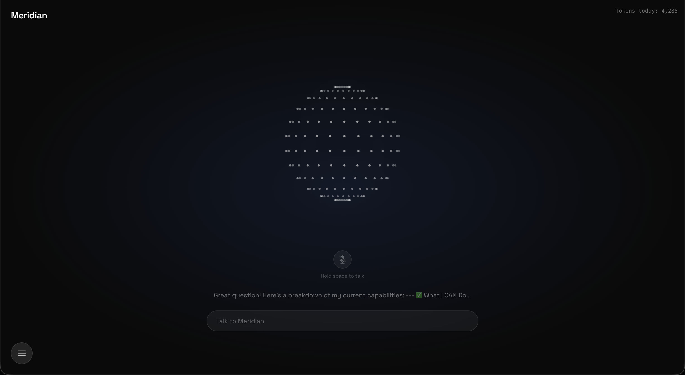
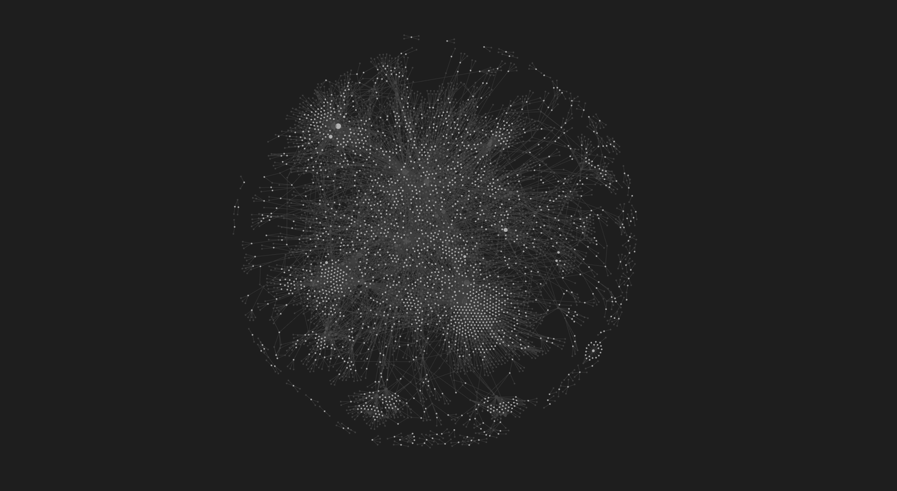

# Meridian

> A local-first personal AI operating system — voice-enabled, email-aware, and wired into your Obsidian vault.



A local-first personal AI operating system. Meridian manages your email accounts,
calendars, and daily information — and lets you interact with all of it through
a voice-enabled animated interface. All data is stored locally; the only outbound
calls are to Claude, VoyageAI, ElevenLabs, and Google APIs.



---

## Features (Phase 1)

- Animated orb UI with idle, listening, thinking, and speaking states
- Gmail OAuth for multiple accounts with email sweep and triage
  - Correct MIME tree body parsing (multipart, nested parts, base64url)
  - Case-insensitive header extraction
  - Rate limiting with exponential backoff on 429s
  - Resumable sweep (progress tracked in the database)
- Claude-powered email triage (trash / archive / keep) with user approval before any Gmail mutation
- Google Calendar sync with today and upcoming event queries
- Text chat and push-to-talk voice via Claude + ElevenLabs
- Live token usage counter (polls the database)
- All data stored locally — nothing leaves your machine except API calls

## Features (Phase 2)

- **Dot-sphere orb** — a canvas-rendered rotating sphere of dots replaces the
  CSS blob, with distinct idle / listening / thinking / speaking motion
- **Chat modal** — full-screen blurred overlay with markdown-rendered replies, a
  textarea that grows with its content, and conversation history pre-loaded from
  the database on page load (the last reply shows as a subtitle under the orb)
- **Onboarding flow** — connect an account, then: choose how much to sweep
  (all / last N / since a date) → watch live progress → review the AI triage →
  approve → build memory (vectorize)
  - Sweep, triage classification, and a one-sentence summary per email happen in
    a single pass (25 emails per Claude call)
  - Per-category review with individual checkboxes and recategorization; only
    your changes are sent on approval
  - Keep + Archive emails are embedded with VoyageAI right after approval
- **Unlimited accounts** — add and remove any number of Google accounts; no fixed
  role slots
- **Obsidian memory layer** — conversations are written to daily notes with
  auto-extracted `[[wikilinks]]`, the vault is ingested into PostgreSQL, and
  relevant notes are retrieved (RAG) into the chat context
- Fixes: the assistant knows the calendar is read-only (no hallucinated
  scheduling), the `?connected=` OAuth param is stripped after sign-in, and chat
  history survives a refresh

## Features (Phase 3 — Intelligence)

- **Email drafting in your voice** — RAG over your own sent mail builds a style
  profile, then Claude drafts replies that match it; drafts are reviewed in the
  Drafts panel before anything is sent
- **Daily brief** — calendar, email, news, and stock watchlist, cached in the
  database and served instantly on open (refresh forces a rebuild)
- **Calendar writes** — Claude can create events via an action-token protocol
- **Settings** — response tone, agent name, digest time, timezone, voice toggle

## Features (Phase 4 — Memory, Intelligence, and Scale)

- **Email threading** — messages are grouped into conversations; chat RAG
  retrieves whole threads instead of fragmented messages
- **Hybrid search** — pgvector similarity fused with Postgres full-text (BM25)
  ranking via Reciprocal Rank Fusion for far better email retrieval
- **Contact intelligence** — a contact graph built from email history (counts,
  recency, topics) is injected into chat context and browsable in Connections
- **Multi-provider AI** — store and toggle Anthropic, OpenAI, Gemini, DeepSeek,
  and Ollama keys, with per-task (chat / classify / draft) model selection; keys
  are encrypted at rest
- **Configurable embeddings** — pick the embedding model in Settings and
  re-embed all data (columns auto-resize when the dimension changes)
- **Supercharge import** — upload a Claude / ChatGPT / Gemini conversation export
  to parse it into your Obsidian vault and vectorize it into memory
- **Scheduled digest** — pre-builds at your set time in your timezone so the
  Brief loads instantly in the morning
- **Brief as a centered modal**, and a **triage mode** setting (aggressive /
  normal / safe)
- Fix: draft intent detection no longer triggers on plain email questions

## Features (Phase 5A — Unified Memory)

- **Obsidian as the knowledge layer** — email threads and contacts are exported
  to your Obsidian vault as fully linked `.md` notes, making Obsidian the single
  source of truth for long-term memory rather than a parallel system
  - `Emails/{Contact}/` — one note per thread with an AI-generated summary,
    the 5 most recent messages, and `[[wikilinks]]` to contacts and topics
  - `Contacts/` — one note per contact with email count, relationship history,
    topics, and links back to their threads
  - Export triggers automatically after triage approval for new accounts; existing
    accounts have a manual "Export to Obsidian" button in the Connections panel
- **Tiered retrieval pipeline** — chat context is assembled in order of richness:
  1. **Tier 1** — semantic search over Obsidian note embeddings (fast, wikilink-rich)
  2. **Tier 2** — triggered by follow-up phrases ("tell me more", "full details");
     searches by participant name first, then vector similarity, then fetches the
     complete thread live from the Gmail API, enriches the Obsidian note, and
     injects the full message bodies into the Claude context in the same request
  3. **Fallback** — raw email thread embeddings if Obsidian has no relevant notes yet
- **Name-aware thread lookup** — extracts person names from queries and searches
  `email_threads.participants` directly before falling back to vector similarity,
  so "what did Alex email me about?" reliably finds Alex's threads
- **Relevance threshold** — tier 2 skips the Gmail fetch if the best vector match
  scores below 0.3 similarity, preventing irrelevant fetches on unrelated queries
- **Previous-query substitution** — pure follow-up phrases ("tell me more", "yes")
  use the last substantive user message as the search query instead of the
  follow-up itself, which has no semantic relationship to any email thread

---

## Features (Phase 5B — Scheduling, Review, and Intelligence)

- **Task registry** — background work follows a single `BaseTask` pattern in
  `backend/services/tasks/`. Adding a scheduled task is one subclass file plus one
  registry entry; the registry also drives the "add task" form in Settings
- **Dynamic scheduler** — a generic scheduler reads the `scheduled_tasks` table
  instead of hardcoded times, so any task can be enabled/disabled and rescheduled
  from the Settings panel. Each run records its status and summary
- **Gmail polling** — new mail is fetched from every connected account every 15
  minutes with no AI calls, stored as `pending` for review (same MIME parsing,
  batching, and 429 backoff as the full sweep)
- **Afternoon email review** — once a day, the day's pending emails are triaged,
  summarized, and (when a reply seems expected) given a queued draft. Nothing is
  applied to Gmail until you approve
- **Daily Review panel** — a newspaper-style digest grouped into Action Required,
  FYI, and Cleaned Up. Approve all pushes triage to Gmail and saves summaries to
  Obsidian; Dismiss takes no action
- **Calendar conflict detection** — creating an event from chat checks for
  overlapping events first and asks you to confirm before scheduling over them
- **Event suggestions from email** — emails that read like a meeting proposal get
  an "Add to calendar" button in the review panel that opens the chat pre-filled

---

## Prerequisites

- macOS or Linux
- Docker and Docker Compose
- Node.js 18+
- Python 3.11+
- PostgreSQL (local install) with the [pgvector](https://github.com/pgvector/pgvector) extension available

## Setup

1. Clone the repo and configure environment:

   ```bash
   git clone https://github.com/yuvanadarsh/meridian.git
   cd meridian
   cp .env.example .env
   # Edit .env with your API keys and local postgres credentials
   ```

2. Create the local database and schema:

   ```bash
   psql -U your_user -c "CREATE DATABASE meridian;"
   psql -U your_user -d meridian -f backend/db/init.sql
   ```

   On an existing database, apply the migrations in order:

   ```bash
   psql -U your_user -d meridian -f backend/db/migrations/002_obsidian_notes.sql
   psql -U your_user -d meridian -f backend/db/migrations/003_email_summary.sql
   psql -U your_user -d meridian -f backend/db/migrations/004_sweep_completed_at.sql
   psql -U your_user -d meridian -f backend/db/migrations/005_fix_embedding_dimensions.sql
   psql -U your_user -d meridian -f backend/db/migrations/006_drafts.sql
   psql -U your_user -d meridian -f backend/db/migrations/007_settings.sql
   psql -U your_user -d meridian -f backend/db/migrations/008_add_timezone_setting.sql
   psql -U your_user -d meridian -f backend/db/migrations/009_digest_cache.sql
   psql -U your_user -d meridian -f backend/db/migrations/010_email_threads.sql
   psql -U your_user -d meridian -f backend/db/migrations/011_hybrid_search.sql
   psql -U your_user -d meridian -f backend/db/migrations/011b_threads_fts.sql
   psql -U your_user -d meridian -f backend/db/migrations/012_contacts_graph.sql
   psql -U your_user -d meridian -f backend/db/migrations/013_ai_providers.sql
   psql -U your_user -d meridian -f backend/db/migrations/014_supercharge.sql
   psql -U your_user -d meridian -f backend/db/migrations/015_triage_mode.sql
   ```

3. (Optional) Point Meridian at your Obsidian vault for the memory layer by
   setting `OBSIDIAN_VAULT_PATH` in `.env` to the vault's **absolute path**
   (e.g. `/Users/you/Documents/MyVault`). Docker Compose mounts this path
   directly into the API container so daily-note writes and RAG reads go to
   your real vault on disk — a relative path will silently write inside the
   container instead. When unset, the daily-note writer and RAG retrieval
   simply no-op.

4. Start Meridian:

   ```bash
   docker compose up --build
   ```

5. Open http://localhost:5173 in **Chrome** — push-to-talk voice relies on the
   Web Speech API, which other browsers don't fully support.

6. Connect your Gmail account via the Connections panel (hamburger menu), which
   drops you straight into the onboarding flow. You can also connect from the CLI:

   ```bash
   python scripts/setup_oauth.py --label personal
   ```

- Frontend: http://localhost:5173
- API: http://localhost:8000
- API docs: http://localhost:8000/docs

### Running the backend without Docker

```bash
cd backend
python -m venv .venv
source .venv/bin/activate
pip install -r requirements.txt
uvicorn main:app --reload --port 8000
```

## API Keys Required

See `.env.example` for all required keys:

- **Anthropic** (Claude API) — reasoning, drafting, and triage
- **ElevenLabs** (TTS) — voice responses
- **VoyageAI** (embeddings) — used from Phase 2
- **Google OAuth** credentials (from the Google Cloud Console) — Gmail + Calendar
- **`SECRET_KEY`** — encrypts AI-provider API keys at rest. Generate one with
  `openssl rand -hex 32` and set it in `.env` before storing any provider key.

Additional AI-provider keys (OpenAI, Gemini, DeepSeek, Ollama) are entered in the
Settings → AI Providers panel and stored encrypted in the database, not in `.env`.

OAuth tokens are stored in the database after first authentication, never in `.env`.

## Architecture

- **Frontend:** React + Vite + TypeScript + Tailwind + Framer Motion
- **Backend:** FastAPI (Python), async SQLAlchemy
- **Database:** PostgreSQL + pgvector (runs on the host, not containerized)
- **AI:** Claude (`claude-sonnet-4-6`) by default for reasoning, with a pluggable
  provider layer (OpenAI / Gemini / DeepSeek / Ollama over OpenAI-compatible
  endpoints); VoyageAI for embeddings (configurable); ElevenLabs for TTS
- **Memory:** unified Obsidian vault — email threads and contacts are exported as
  linked `.md` notes, daily conversation notes are appended after each exchange,
  and the entire vault is ingested into pgvector via a background watcher.
  Retrieval is tiered: Obsidian note search → live Gmail API fetch → raw thread embeddings
- **Retrieval:** thread-aware hybrid search (pgvector + Postgres full-text fused
  with Reciprocal Rank Fusion) with name-aware participant lookup and a
  relevance threshold before any live Gmail fetch

Only the `api` and `frontend` services run in Docker; the API container reaches
your host PostgreSQL via `host.docker.internal`.

## Roadmap

- [x] Calendar conflict detection (Phase 5B)
- [x] Scheduled background tasks with a configurable scheduler (Phase 5B)
- [ ] Email send from Drafts panel via Gmail API
- [ ] Connect multiple Gmail accounts through the existing onboarding UI
- [ ] Setup wizard for first-time users
- [ ] Docker Hub image for one-command install
- [ ] Always-on wake word (currently push-to-talk only)
- [ ] Slack integration

## Contributing

PRs welcome. If you clone Meridian and build something on top of it, open an issue
to share what you made — integrations, embedding model support, new UI panels, and
wake-word implementations are all good starting points.

## License

MIT
