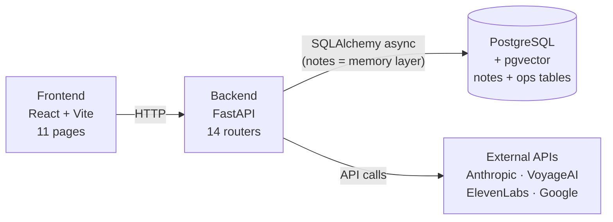
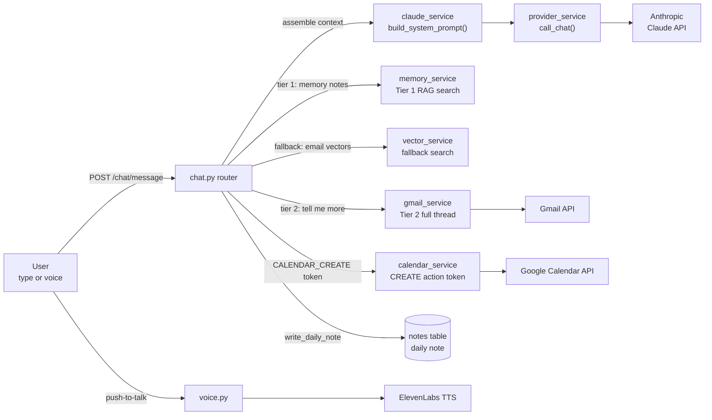
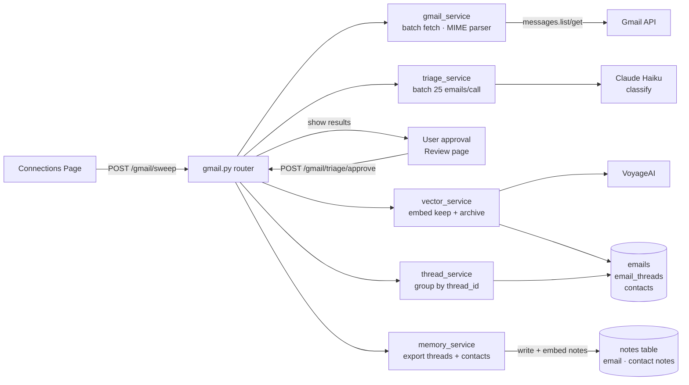
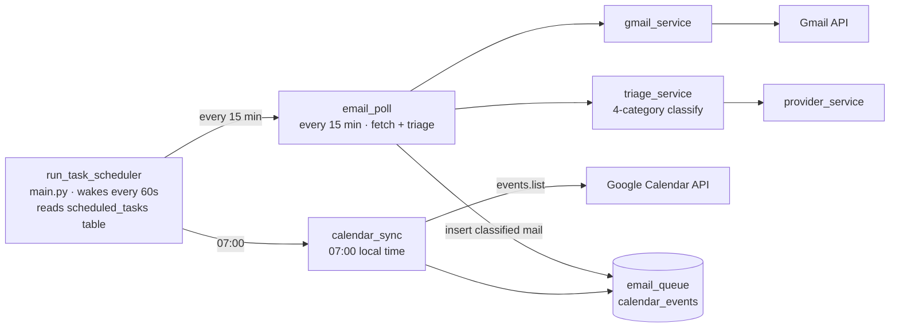
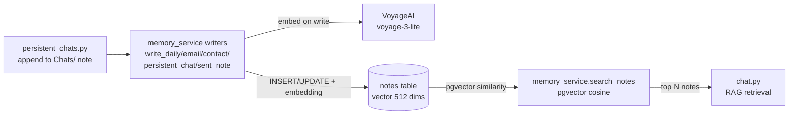
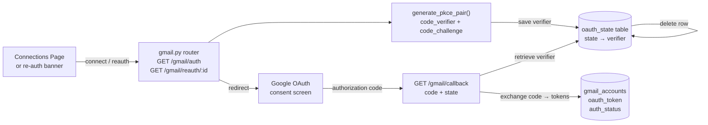

# Meridian Architecture

> Verified against source files. Last updated: 2026-06-29

## System Overview

Meridian is a local-first personal AI OS. The FastAPI backend runs in Docker and
communicates with a host-machine PostgreSQL instance and four external APIs
(Anthropic, VoyageAI, ElevenLabs, Google). The React frontend is served by a Vite
dev server in a second container and reaches the backend over HTTP. All long-term
memory lives in PostgreSQL — `memory_service` writes notes to the `notes` table and
embeds them on write, and chat queries them via a tiered RAG pipeline.

## Architecture Diagram

### System Overview

### Pipeline 1 — Chat & RAG

### Pipeline 2 — Email Sweep

### Pipeline 3 — Scheduled Tasks

### Pipeline 4 — PostgreSQL Memory

### Pipeline 5 — OAuth Flow

## Pipeline Descriptions

### Pipeline 1 — Chat & RAG

The daily chat and all persistent chat threads share the same chat router.
For each message, the router assembles a system prompt (calendar context, tone,
action protocol) via `claude_service`, then performs tiered RAG retrieval:
Tier 1 searches `email`/`contact` note embeddings first, falls back to raw email
thread vectors if nothing relevant is found; Tier 2 — triggered by follow-up phrases
like "tell me more" or "full details" — fetches the complete thread directly from
the Gmail API, writes an enriched note to the `notes` table, and injects full message
bodies into the same Claude request. Responses that contain a `CREATE_CALENDAR_EVENT`
action token are intercepted by the router and forwarded to `calendar_service`.
Voice responses are synthesized via ElevenLabs at the end of the turn.

### Pipeline 2 — Email Sweep

Triggered from the Connections page, the sweep processes one Gmail account at a
time. `gmail_service` fetches messages in batches of 25 with a 0.1 s inter-call
delay and exponential backoff on 429 responses; each message body is extracted via
a BFS traversal of the MIME part tree. `triage_service` classifies batches of 25
emails per Claude Haiku call into keep / archive / trash / unreadable. Triage
results are shown to the user for approval — nothing is written to Gmail without
explicit confirmation. After approval, `vector_service` embeds the keep and archive
emails via VoyageAI; `thread_service` groups them into `email_threads` rows; and
`memory_service` writes an `email` note per thread and a `contact` note per contact
(embedded on write) to the `notes` table.

### Pipeline 3 — Scheduled Tasks

A generic scheduler (`run_task_scheduler` in `main.py`) wakes every 60 seconds and
reads the `scheduled_tasks` table. Email poll runs on a fixed 15-minute interval: it
fetches new mail via `gmail_service`, then immediately classifies each message with
`triage_service` into one of `trash`/`archive`/`keep`/`draft` and inserts a row into
`email_queue` (continuous triage on arrival). The clock-based `calendar_sync` task
fires when the user's local time matches its configured `schedule_time` and it has not
already run today (checked against the user's local date, not UTC). Nothing is applied
to Gmail by the scheduler — the queue accumulates until the user approves it on the
Inbox page. Task run status and summaries are written back to the `scheduled_tasks`
row so the Settings UI can show when each task last ran.

### Pipeline 4 — PostgreSQL Memory

Memory lives entirely in the `notes` table. `memory_service.write_note` upserts a
note by title (appending on a title collision) and embeds it immediately via the
configured model — there is no filesystem vault and no background watcher. Typed
writers cover each source: daily chat exchanges, email-thread summaries, contact
profiles, persistent-chat threads (mirrored to a `Chats/` note), and sent mail. RAG
retrieval during chat calls `memory_service.search_notes`, which runs pgvector cosine
similarity over the `notes` table and can filter by `note_type`. If embedding fails on
write, the note is still stored with a NULL embedding and a warning is logged.

### Pipeline 5 — OAuth Flow

When a user connects a new Gmail account, the frontend hits `GET /gmail/auth?label=`.
The router generates a PKCE (code_verifier / code_challenge) pair, stores the
verifier in the `oauth_state` table keyed by a random state token, and redirects the
user to the Google consent screen. On callback, the router retrieves the verifier from
the database, exchanges the authorization code for tokens, and stores the token JSON
in `gmail_accounts.oauth_token`. The `oauth_state` row is deleted immediately after
the exchange completes. Re-authentication for an expired token follows the same flow
via `GET /gmail/reauth/{account_id}`.
