# Meridian Architecture

> Verified against source files. Last updated: 2026-06-27

## System Overview

Meridian is a local-first personal AI OS. The FastAPI backend runs in Docker and
communicates with a host-machine PostgreSQL instance, an Obsidian vault on the
filesystem, and four external APIs (Anthropic, VoyageAI, ElevenLabs, Google). The
React frontend is served by a Vite dev server in a second container and reaches the
backend over HTTP. All long-term memory flows through the Obsidian vault, which is
indexed into pgvector and queried via a tiered RAG pipeline.

## Architecture Diagram

```mermaid
flowchart TD

    %% ── External APIs ──────────────────────────────────────────────────────────
    subgraph Ext["External APIs"]
        direction LR
        ClaudeAPI["Anthropic Claude API\nsonnet-4-6 · haiku-4-5"]
        VoyageAPI["VoyageAI\nvoyage-3-lite, 512 dims"]
        ElevenLabsAPI["ElevenLabs TTS"]
        GmailAPI["Gmail API"]
        CalAPI["Google Calendar API"]
    end

    %% ── Frontend ───────────────────────────────────────────────────────────────
    subgraph FE["Frontend — React + Vite + TypeScript + Tailwind"]
        direction LR
        Home["/ Home\norb + chat modal"]
        ChatPage["/chat\nPersistent Chat"]
        ChatDetail["/chat/:id\nChat Thread"]
        AnalyticsPage["/analytics"]
        BriefPage["/brief\nDaily Brief"]
        ReviewPage["/review\nDaily Review"]
        DraftsPage["/drafts"]
        CalPage["/calendar"]
        ContactsPage["/contacts"]
        ConnectionsPage["/connections\nAccount Setup & Onboarding"]
        SettingsPage["/settings"]
    end

    %% ── Backend Routers ────────────────────────────────────────────────────────
    subgraph Routers["Backend Routers — FastAPI"]
        direction TB
        ChatR["chat.py\nRAG · action tokens · context assembly"]
        GmailR["gmail.py\nOAuth · sweep · triage approval"]
        CalR["calendar.py\nread events · create event"]
        PChatsR["persistent_chats.py\nCRUD · auto-title"]
        ReviewR["review.py\nafternoon review"]
        UsageR["usage.py\ncost aggregation"]
        TasksR["tasks.py\nscheduled task CRUD"]
        SettingsR["settings.py\nkey/value settings"]
        ContactsR["contacts.py\ncontact graph + Obsidian export"]
        DigestR["digest.py\nmorning brief"]
        DraftsR["drafts.py\ndraft CRUD + send"]
        VoiceR["voice.py\npush-to-talk + TTS"]
        SuperchargeR["supercharge.py\nAI chat export import"]
        ObsidianR["obsidian.py\ndaily note append"]
    end

    %% ── Backend Services ───────────────────────────────────────────────────────
    subgraph Services["Backend Services"]
        direction TB
        ProvSvc["provider_service\nmulti-provider AI routing\nAnthropicSDK · OpenAI-compat\nencrypted key decryption · usage logging"]
        ClaudeSvc["claude_service\nsystem prompt builder\ntone · calendar/email context\naction protocol · allow_draft gate"]
        VecSvc["vector_service\nVoyageAI embedding\nhybrid BM25+vector search\nReciprocal Rank Fusion"]
        ObsSvc["obsidian_service\nvault watcher · daily notes\nnote vectorizer · RAG retrieval\nthread + contact export"]
        GmailSvc["gmail_service\nOAuth/PKCE · MIME tree parser\nsweep + rate limiting\ntier-2 full thread fetch"]
        DigestSvc["digest_service\ncalendar + email + news + stocks\nvoice-ready plain text · digest_cache"]
        TriageSvc["triage_service\nbatch classification (Haiku)\nkeep / archive / trash / unreadable"]
        DraftSvc["draft_service\nRAG style profile\ndraft generation"]
        CalSvc["calendar_service\nevent sync · conflict detection\ncreate via action token"]
        UsageSvc["usage_service\nper-call cost logging\nusage_log table"]
        ThreadSvc["thread_service\nthread grouping · participant index\nhybrid search over email_threads"]
        ContactSvc["contact_service\ncontact graph · topic extraction\nObsidian Contacts/ export"]
    end

    %% ── Scheduled Tasks ────────────────────────────────────────────────────────
    subgraph Tasks["Scheduled Tasks — services/tasks/"]
        direction LR
        Scheduler["run_task_scheduler\nmain.py lifespan · wakes every 60s\nreads scheduled_tasks table\nuser timezone-aware"]
        EmailPoll["email_poll\nevery 15 min\nno AI calls\nstores as pending"]
        MBTask["morning_brief\n08:00 default\ndigest_cache upsert"]
        ARTask["afternoon_review\n17:00 default\ntriage + draft queue\nafternoon_reviews table"]
        CSTask["calendar_sync\n07:00 default\nupsert calendar_events"]
    end

    %% ── PostgreSQL ─────────────────────────────────────────────────────────────
    subgraph DB["PostgreSQL + pgvector — host machine"]
        EmailsDB[("emails\nemail_threads\ngmail_accounts\nsweep_progress")]
        ObsNotesDB[("obsidian_notes\nvector 512 dims")]
        ContactsDB[("contacts\nvector 512 dims")]
        ChatDB[("chat_messages\npersistent_chats\npersistent_chat_messages")]
        OpsDB[("drafts · calendar_events\nafternoon_reviews · digest_cache\nscheduled_tasks · user_settings\nai_providers · oauth_state\nusage_log · supercharge_imports")]
    end

    %% ── Obsidian Vault ─────────────────────────────────────────────────────────
    ObsVault[("Obsidian Vault — filesystem\nDaily/YYYY-MM-DD.md\nEmails/Contact/Subject.md\nContacts/Name.md\nChats/ · AI Conversations/")]

    %% ═══════════════════════════════════════════════════════════════════════════
    %% Pipeline 1 — Chat & RAG
    %% ═══════════════════════════════════════════════════════════════════════════
    subgraph ChatPipeline["Pipeline 1 — Chat & RAG"]
        direction LR
        Home -->|"POST /chat/message"| ChatR
        ChatR -->|"build system prompt"| ClaudeSvc
        ClaudeSvc -->|"assembled prompt"| ProvSvc
        ProvSvc -->|"Anthropic SDK"| ClaudeAPI
        ChatR -->|"tier 1: Obsidian note search"| ObsSvc
        ChatR -->|"tier 1 fallback: email vectors"| VecSvc
        ChatR -->|"tier 2 phrases: full thread"| GmailSvc
        GmailSvc -->|"messages.threads.get"| GmailAPI
        ChatR -->|"CREATE_CALENDAR_EVENT token"| CalSvc
        CalSvc -->|"events.insert"| CalAPI
        Home -->|"push-to-talk"| VoiceR
        VoiceR -->|"ElevenLabs synthesis"| ElevenLabsAPI
    end

    %% ═══════════════════════════════════════════════════════════════════════════
    %% Pipeline 2 — Email Sweep
    %% ═══════════════════════════════════════════════════════════════════════════
    subgraph SweepPipeline["Pipeline 2 — Email Sweep"]
        direction LR
        ConnectionsPage -->|"POST /gmail/sweep/{account_id}"| GmailR
        GmailR -->|"messages.list + messages.get\nbatch 25, 0.1s delay, 429 backoff"| GmailSvc2["gmail_service"]
        GmailSvc2 -->|"MIME tree parser"| GmailAPI
        GmailR -->|"batch classify 25 emails/call"| TriageSvc
        TriageSvc -->|"Haiku model"| ProvSvc
        GmailR -->|"user approves in UI"| VecSvc
        VecSvc -->|"embed keep + archive"| VoyageAPI
        GmailR --> ThreadSvc
        ThreadSvc --> EmailsDB
        GmailR -->|"export threads + contacts"| ObsSvc
        ObsSvc -->|"write Emails/ + Contacts/ notes"| ObsVault
    end

    %% ═══════════════════════════════════════════════════════════════════════════
    %% Pipeline 3 — Scheduled Tasks
    %% ═══════════════════════════════════════════════════════════════════════════
    subgraph ScheduledPipeline["Pipeline 3 — Scheduled Tasks"]
        direction LR
        Scheduler -->|"every 15 min"| EmailPoll
        Scheduler -->|"08:00 local time"| MBTask
        Scheduler -->|"17:00 local time"| ARTask
        Scheduler -->|"07:00 local time"| CSTask
        EmailPoll -->|"sweep new mail"| GmailSvc
        MBTask --> DigestSvc
        DigestSvc -->|"news + digest assembly (Haiku)"| ProvSvc
        DigestSvc --> OpsDB
        CSTask --> CalSvc
        CalSvc -->|"events.list"| CalAPI
        ARTask --> TriageSvc
        ARTask --> DraftSvc
        DraftSvc -->|"RAG style profile + draft"| ProvSvc
        ARTask --> OpsDB
    end

    %% ═══════════════════════════════════════════════════════════════════════════
    %% Pipeline 4 — Obsidian Memory
    %% ═══════════════════════════════════════════════════════════════════════════
    subgraph ObsidianPipeline["Pipeline 4 — Obsidian Memory"]
        direction LR
        ObsVault -->|"watch_vault every 30s\nscan_vault_on_startup"| ObsSvc
        ObsSvc -->|"index .md files"| ObsNotesDB
        ObsSvc -->|"embed notes batch=128\nvectorize_notes_loop every 5min"| VecSvc
        VecSvc -->|"voyage-3-lite"| VoyageAPI
        VecSvc -->|"pgvector cosine search"| ObsNotesDB
        PChatsR -->|"mirror to Chats/ vault note"| ObsVault
    end

    %% ═══════════════════════════════════════════════════════════════════════════
    %% Pipeline 5 — OAuth Flow
    %% ═══════════════════════════════════════════════════════════════════════════
    subgraph OAuthPipeline["Pipeline 5 — OAuth Flow"]
        direction LR
        ConnectionsPage -->|"GET /gmail/auth?label="| GmailR
        GmailR -->|"PKCE verifier saved"| OpsDB
        GmailR -->|"redirect to consent"| GmailAPI
        GmailR -->|"code exchange\ntoken stored in gmail_accounts"| EmailsDB
    end

    %% ── Shared wiring ──────────────────────────────────────────────────────────
    ProvSvc --> UsageSvc
    UsageSvc --> OpsDB
    VecSvc --> EmailsDB
    VecSvc --> ObsNotesDB
    ContactSvc --> ContactsDB
    CalSvc --> OpsDB
    PChatsR --> ChatDB

    ChatPage --> PChatsR
    ChatDetail --> PChatsR
    AnalyticsPage --> UsageR
    UsageR --> OpsDB
    BriefPage --> DigestR
    DigestR --> DigestSvc
    ReviewPage --> ReviewR
    ReviewR --> OpsDB
    DraftsPage --> DraftsR
    DraftsR --> OpsDB
    CalPage --> CalR
    CalR --> CalSvc
    ContactsPage --> ContactsR
    ContactsR --> ContactSvc
    SettingsPage --> SettingsR
    SettingsR --> OpsDB
    TasksR --> OpsDB
```

## Pipeline Descriptions

### Pipeline 1 — Chat & RAG

The daily chat and all persistent chat threads share the same chat router.
For each message, the router assembles a system prompt (calendar context, tone,
action protocol) via `claude_service`, then performs tiered RAG retrieval:
Tier 1 searches Obsidian note embeddings first, falls back to raw email thread
vectors if nothing relevant is found; Tier 2 — triggered by follow-up phrases
like "tell me more" or "full details" — fetches the complete thread directly from
the Gmail API, enriches the Obsidian note in place, and injects full message
bodies into the same Claude request. Responses that contain a `CREATE_CALENDAR_EVENT`
action token are intercepted by the router and forwarded to `calendar_service`.
Voice responses are synthesized via ElevenLabs at the end of the turn.

### Pipeline 2 — Email Sweep

Triggered from the Connections page, the sweep processes one Gmail account at a
time. `gmail_service` fetches messages in batches of 25 with a 0.1 s inter-call
delay and exponential backoff on 429 responses; each message body is extracted via
a BFS traversal of the MIME part tree. `triage_service` classifies batches of 25
emails per Claude Haiku call into keep / archive / trash / unreadable. Triage
results are shown to the user for approval — nothing is written to Gmail without
explicit confirmation. After approval, `vector_service` embeds the keep and archive
emails via VoyageAI; `thread_service` groups them into `email_threads` rows; and
`obsidian_service` exports each thread and contact to the vault.

### Pipeline 3 — Scheduled Tasks

A generic scheduler (`run_task_scheduler` in `main.py`) wakes every 60 seconds and
reads the `scheduled_tasks` table. Email poll runs on a fixed 15-minute interval and
makes no AI calls — it stores new messages as `pending` for the afternoon review.
The three clock-based tasks (morning brief, afternoon review, calendar sync) fire
when the user's local time matches their configured `schedule_time` and they have not
already run today (checked against the user's local date, not UTC). The afternoon
review task triages the day's pending emails with Claude Haiku, queues draft replies
where a response seems expected, and writes the results to `afternoon_reviews`; the
user approves in the Daily Review panel before anything is sent. Task run status and
summaries are written back to the `scheduled_tasks` row so the Settings UI can show
when each task last ran.

### Pipeline 4 — Obsidian Memory

On startup, `obsidian_service` scans the vault for existing `.md` files and indexes
them into the `obsidian_notes` table. A background `watch_vault` coroutine then polls
for changes every 30 seconds; a separate `vectorize_notes_loop` coroutine embeds
unvectorized notes via VoyageAI in batches of 128, every 5 minutes. RAG retrieval
during chat searches `obsidian_notes` using pgvector cosine similarity, prioritising
`Emails/` and `Contacts/` paths. Persistent chat threads are mirrored to `Chats/`
vault notes after every message so the Obsidian graph grows over time.

### Pipeline 5 — OAuth Flow

When a user connects a new Gmail account, the frontend hits `GET /gmail/auth?label=`.
The router generates a PKCE (code_verifier / code_challenge) pair, stores the
verifier in the `oauth_state` table keyed by a random state token, and redirects the
user to the Google consent screen. On callback, the router retrieves the verifier from
the database, exchanges the authorization code for tokens, and stores the token JSON
in `gmail_accounts.oauth_token`. The `oauth_state` row is deleted immediately after
the exchange completes. Re-authentication for an expired token follows the same flow
via `GET /gmail/reauth/{account_id}`.
